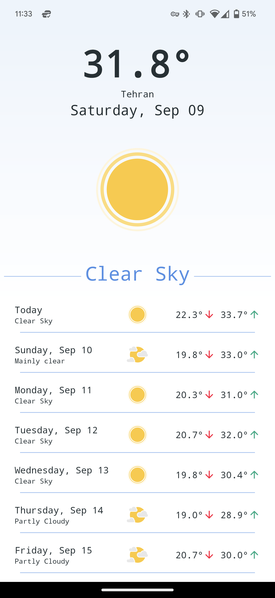

# Simple Weather

Simple Weather is a weather app 
 Used Kotlin, MVVM and Clean Architecture to develop application.
 Used Koin for dependency injection.
 Used Single Activity design pattern.
 Used Coroutines for asyncronous process.
 Used Retrofit to communicate with server.
 Used Lottie to load animations.

  

# Table of Contents
1. [Technologies](https://github.com/ShahabGT/Weather#technologies) 
2. [Overview](https://github.com/ShahabGT/Weather#overview) 
3. [Clean Architecture](https://github.com/ShahabGT/Weather#clean-architecture) 
4. [Download](https://github.com/ShahabGT/Weather#download) 

# Technologies Used
this app is complied over SDK 34 (android 14). minimum supported android version is SDK 24 (android 7).
 Kotlin version 1.9 and koin version 3.4.3 is used.
 Retrofit and okhttp client is used for api called and logging interceptor. gson is used for converting api responses.
 Google Geo Coder is used for getting address locality based on Latitude and Longitude.
 Jetpack Navigation Component is used for loading and navigating between fragments.
 Material 3 is used for designing layouts and supporting Light/Night themes.
 Junit and Mockk is used for viewModel tests and mocking data classes.
 Gradle version 8 is used for build system and CD.
 Git is used for version controlling.

# Overview
At the app start, it will load a default json weather model. with a pull on the main screen, a Location Permision dialog will show and asks for proximate location and after that if the device location is disabled it will show another dialog to alert user to enable the device location.
 this app uses open-meteo.com apis for getting the weather base on user latitude an longitude.
 Weather code, maximum tempreature, minimum tempreature, address locality, 10 day forecast and current hour tempreature is shown to the user.
 maximum request time-out is 30 seconds on production and 90 seconds on develop.
 between each request a loading screen is shown to the user and if something happens an error dialog with a retry button is shown.

# Clean Architecture
The project consist of 3 modules, App, Data and Domain.
 the app module has access to both Data and Domain modules. the Data module has access to Domain module. the Domain module is does not have access to any modules.
## App
this module, contains BaseActivity, MainFragment and RecyclerView Adapter and Koin Dependency Injection.
 tests is also in this module
 app icon and app design is present in the res folder

## Data
this module contains the Retrofit Configm Local and Remote data sources implementations. All the mappers in the app is present in this module. General Error handler and Extentions is can be found here too.
 all the animation files and sample_weather json file is in res-raw folder.
 this module does not contains any layout designs

## Domain
Server response data classes and local and remote data source interfaces and be found in this module.
 this module does not have any drawable or layout designs.

# Download
[Downlaod](https://github.com/ShahabGT/Weather/blob/master/eliq_weather_v.1.0.0.apk)

# Developed By

* Shahab Azimi
 * [shahabazimi.ir](http://shahabazimi.ir) - <azimishahab@gmail.com>
